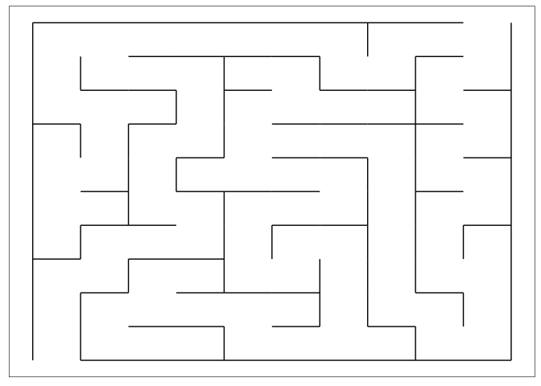

Generate a maze in Minecraft
================
Gergely Daroczi

This example illustrates how to generate a perfect maze from R and the render in Minecraft.

Generate a random maze
----------------------

First, we need to generate a maze, for which we will use the [`Rmaze`](https://github.com/Vessy/Rmaze) R package's depth-first search algorithm. As the package is not on CRAN, you have to install from GitHub:

``` r
devtools::install_github('Vessy/Rmaze')
```

Then load the package and generate a maze with, for example, 10 x 10 tiles:

``` r
library(Rmaze)

n <- 10
maze <- makeGraph(n, n)
set.seed(42)
maze <- makeMaze_dfs(maze)
```

This is a graph representation of the maze, which can be rendered with `ggplot2` very easily:

``` r
plotMaze(maze, n, n)
```



Transform maze graph into matrix
--------------------------------

Now we have to transform this graph representation into a binary matrix, where we see in 2D which blocks need to be air or wall. Let's start with a large empty `matrix` allowing 4 block for every single cell, as in the matrix we will use blocks for the wall as well (unlike in the above plot):

``` r
df <- matrix(NA, nrow = n*4, ncol = n*4)
```

Then let's mark the surrounding border with ones:

``` r
df[c(1, nrow(df)), ] <- 1
df[, c(1, nrow(df))] <- 1
```

Here is the top corner of the matrix now:

``` r
df[1:4, 1:4]
```

    ##      [,1] [,2] [,3] [,4]
    ## [1,]    1    1    1    1
    ## [2,]    1   NA   NA   NA
    ## [3,]    1   NA   NA   NA
    ## [4,]    1   NA   NA   NA

But we should leave the entrance and exit open in the bottom left and top right corner:

``` r
df[1, ncol(df) - 1:2] <- NA
df[nrow(df), 2:3] <- NA
```

Here is the top right corner showing the maze exit:

``` r
df[1:4, ncol(df) - 3:0]
```

    ##      [,1] [,2] [,3] [,4]
    ## [1,]    1   NA   NA    1
    ## [2,]   NA   NA   NA    1
    ## [3,]   NA   NA   NA    1
    ## [4,]   NA   NA   NA    1

Now we need to convert the graph object into a `data.frame` on which we can iterate later to render the actual wall blocks:

``` r
library(igraph)
mazedf <- as_data_frame(maze)
library(data.table)
setDT(mazedf)
```

Then let's extract the `x` and `y` positions from the `A_x_y` names:

``` r
for (v in c('from', 'to')) {
    mazedf[, (paste0(v, 'x')) := as.numeric(sub('A_([0-9]*)_[0-9]*', '\\1', get(v)))]
    mazedf[, (paste0(v, 'y')) := as.numeric(sub('A_[0-9]*_([0-9]*)', '\\1', get(v)))]
}
```

And let's also record in which direction the edge points:

``` r
mazedf[fromx < tox, direction := 'top']
mazedf[fromy < toy, direction := 'right']
```

Now let's map the `x` and `y` coordinates to the 2D matrix:

``` r
mazedf[, x := nrow(df) - fromx * 4 + 3 - as.numeric(direction == 'top') * 2]
mazedf[, y := fromy * 4 - 1 + as.numeric(direction == 'right') * 2]
```

And then let's update the blank matrix `NA` cells with 1, 2 or 3 to represent the actual walls:

``` r
for (i in seq_len(nrow(mazedf))) {
    cell <- mazedf[i]
    if (cell$wall == 'ON') {
        df[cell$x + -1:0, cell$y + -1:0] <- 1
    }
    if (cell$direction == 'top' & cell$wall == 'ON') {
        df[cell$x - 0:1, cell$y - 1:2] <- 2
    }
    if (cell$direction == 'right' & cell$wall == 'ON') {
        df[cell$x - 2:3, cell$y - 0:1] <- 3
    }
}
```

I know it was a bit tricky, and probably there's a nicer and lot more elegant way to do all this :) But at least this works and results in something like:


Render the maze in Minecraft
----------------------------

Now that we have a binary matrix representation of the maze, it's very easy to render the related blocks in Minecraft. First, we need to load the `miner` package and establish a connection to a Minecraft server:

``` r
library(miner)
mc_connect()
```

Next, we will clean up some space, then generate the floor (diamond) and ceiling (glass), then the wall blocks(gold):

``` r
## clean up some space
setBlocks(1, 50, 1, nr, 54, nc, 0)
## add floor
setBlocks(1, 50, 1, nr, 50, nc, 57)
## add torch
setBlocks(nr - 4, 51, 2, nr, 52, 4, 50)
## maze ceiling
setBlocks(1, 54, 1, nr, 54, nc, 95)
## 3 blocks tall maze walls
for (i in 1:nrow(df)) {
    for (j in 1:ncol(df)) {
        if (!is.na(df[i, j])) {
            setBlock(i, 51, j, 41)
            setBlock(i, 52, j, 41)
            setBlock(i, 53, j, 41)
        }
    }
}
```

The result looks like this:


